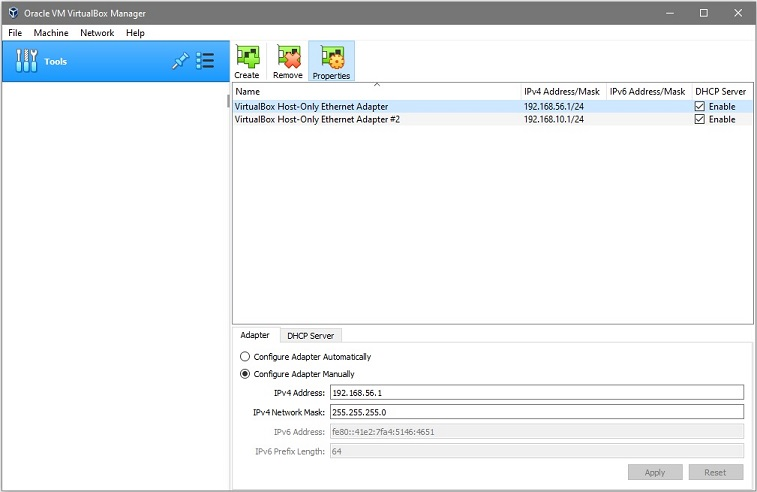

# Laravel on Ubuntu 20.04

### v1.0.0

requirement : git, composer, virtualbox, vagrant, heidisql

    composer global require laravel/installer

    git clone https://github.com/jiehoes/lvtofossa.git

    cd lvtofossa

    composer install

Create local network

.vagrantfile set IP to: 192.168.56.30

.env set to: DB_HOST=192.168.56.30

    vagrant up

    vagrant ssh

#### heidisql

create new session host:192.168.56.30 user:root pass:root

    php artisan migrate

#### environment

    DB_CONNECTION=mysql

    DB_HOST=192.168.56.30

    DB_PORT=3306

    DB_DATABASE=laravel

    DB_USERNAME=root

    DB_PASSWORD=root

#### mapserver

we've modified this:

sudo nano /etc/apache2/conf-enabled/serve-cgi-bin.conf

    ScriptAlias /cgi-bin/ /usr/lib/cgi-bin/

    <Directory "/usr/lib/cgi-bin/">

    AllowOverride All

    Options +ExecCGI -MultiViews +FollowSymLinks

    AddHandler fcgid-script .fcgi

    Require all granted

    </Directory>

see http://192.168.56.30

see http://192.168.56.30/cgi-bin/mapserv?

### v1.0.1

Laravel v.8

Windows: C:\Windows\System32\drivers\etc\hosts

    192.168.56.30   lvtofossa-laravel8-01.vagrant

see http://lvtofossa-laravel8-01.vagrant

see http://lvtofossa-laravel8-01.vagrant/cgi-bin/mapserv?

### v1.0.2

Install an SSL certificate for the local server using MKCERT to run the HTTPS protocol.

To redirect http to https page, please edit .conf file:

    $ sudo nano /etc/apache2/sites-enabled/lvtofossa-laravel8-01.vagrant.conf

    <VirtualHost *:80>

    ServerName lvtofossa-laravel8-01.vagrant

    Redirect / https://lvtofossa-laravel8-01.vagrant

    #RewriteEngine on

    #RewriteCond %{SERVER_NAME} =lvtofossa-laravel8-01.vagrant

    #RewriteRule ^ https://%{SERVER_NAME}%{REQUEST_URI} [END,NE,R=permanent]

    </VirtualHost>

    $ sudo systemctl restart apache2

see https://lvtofossa-laravel8-01.vagrant

see https://lvtofossa-laravel8-01.vagrant/cgi-bin/mapserv?

### v1.0.3

[How To Install PostgreSQL 12 on Ubuntu 20.04/18.04/16.04](https://computingforgeeks.com/install-postgresql-12-on-ubuntu/)

[How To Install PostGIS on Ubuntu 20.04/18.04 | Debian 10](https://computingforgeeks.com/how-to-install-postgis-on-ubuntu-debian/)

[Install pgAdmin 4 on Ubuntu 20.04/18.04/16.04](https://computingforgeeks.com/how-to-install-pgadmin-4-on-ubuntu/)

see https://lvtofossa-laravel8-01.vagrant/pgadmin4

usernema: admin@gmail.com

password: P3rtamax
